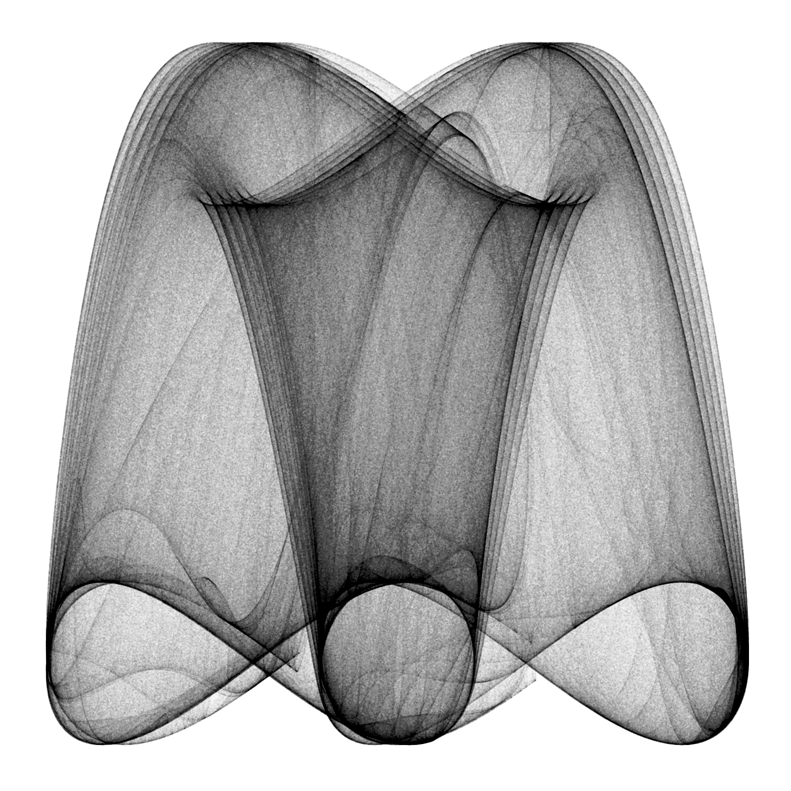

strange attractors created based on 
3h wind forecast for the given location

### Setup
```
R
> install.packages("ggplot2")
> install.packages("owmr")
> install.packages("dplyr")

cp .Renviron.sample .Renviron
# Add owm api key

Rscript bird.R "New York"
```

## São Paulo 2020-07-25 18:00:00


## Amsterdam 2020-07-25 18:00:00


## Tokyo 2020-07-25 21:00:00


## Wellington 2020-07-25 21:00:00.png


## Colombo 2020-07-25 18:00:00


## New York 2020-07-25 21:00:00

