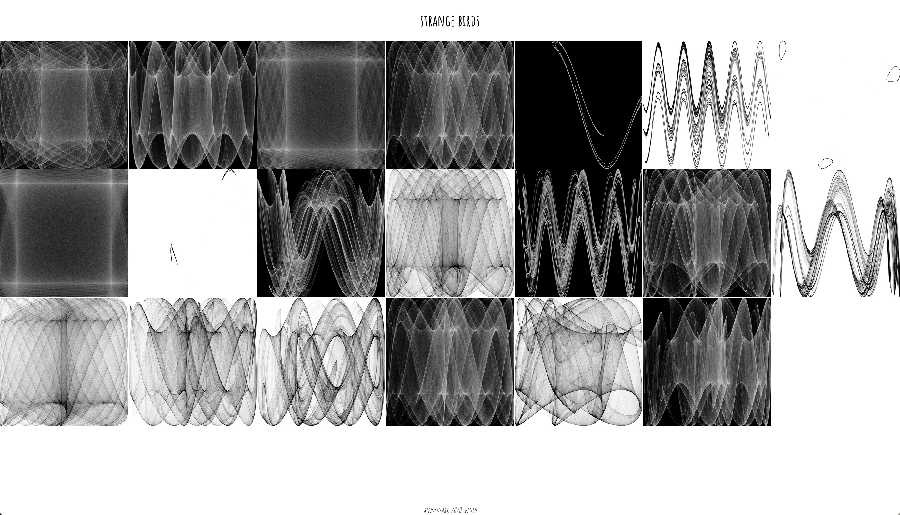

strange attractors created based on 
3h wind forecast for the given location

### Setup
```
R
> install.packages("cowplot")
> install.packages("ggplot2")
> install.packages("owmr")
> install.packages("dplyr")

cp .Renviron.sample .Renviron
# Add owm api key

Rscript bird.R "New York" black white
```



[click here to see more](https://vloth.github.io/bird/)
